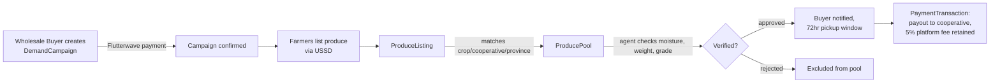

# Pamodzi Backend — Engineering Documentation

---

### Pamodzi API Docs- https://pamodzi-bbe9f0671866.herokuapp.com/docs

## System Overview

Pamodzi's backend is a single FastAPI service that every client — the farmer-facing USSD/SMS channel, the cooperative agent app, the wholesale buyer app, and the admin web dashboard. There is one PostgreSQL database and one API built on heroku.

The service is deployed on Heroku as a single web running Uvicorn directly (`Procfile`: `web: uvicorn main:app --host 0.0.0.0 --port ${PORT}`). Three third-party services are integrated: **Flutterwave** for buyer payments and cooperative payouts, **Africa's Talking** for USSD and SMS, and **LocationIQ** for turning cooperative addresses into coordinates for the buyer's pickup.

The core business flow the whole schema is built around: a wholesale buyer funds a demand campaign → farmers list matching produce over USSD → the platform pools matching listings → a cooperative agent verifies the pooled produce (moisture, weight, grade) → the buyer collects within a fixed window → the platform takes its fee and releases the rest to the cooperative. Nearly every table in this system exists to support one step of that flow.

---

## Getting Started

```bash
git clone <repo>
cd Phoenix_Backend
python -m venv env
source env/bin/activate
pip install -r requirements.txt
```

#### Required environment variables

Create a `.env` file in the project root. These are the variables the app actually reads on startup (`database.py`, `core/security.py`, and the integration services) — the app will fail at import time.

| Variable                                                                                        | Used for                                                                                                                                                                       |
| ----------------------------------------------------------------------------------------------- | ------------------------------------------------------------------------------------------------------------------------------------------------------------------------------ |
| `DATABASE_URL`                                                                                  | Postgres connection string. `postgres://` is auto-rewritten to `postgresql://` at startup —                                                                                    |
| `SECRET_KEY`                                                                                    | RS256 keypair.                                                                                                                                                                 |
| `ALGORITHM`                                                                                     | JWT algorithm, currently `RS256`.                                                                                                                                              |
| `ACCESS_TOKEN_EXPIRE_MINUTES`                                                                   | JWT lifetime in minutes.                                                                                                                                                       |
| `AT_USERNAME`, `AT_API_KEY`                                                                     | Africa's Talking credentials (USSD + SMS).                                                                                                                                     |
| `LOCATION_API_KEY`                                                                              | LocationIQ geocoding key.                                                                                                                                                      |
| `FLW_REDIRECT_URL`, `flutterwave_sk`, `flutterwave_base_url`, `flutterwave_webhook_secret_hash` | Flutterwave integration                                                                                                                                                        |
| `ADMIN_EMAIL`, `ADMIN_NRC`, `ADMIN_PASSWORD`, `ADMIN_PHONE`                                     | Used once, on first boot, to seed the very first admin account directly into the database. this is how the admin gets the first login, not the `/auth/admin/onboard` endpoint. |

#### Running locally

```bash
uvicorn main:app --reload
```

On startup, `main.py`'s `lifespan` function runs `Base.metadata.create_all()`, seeds the first admin account if none exists, runs an initial market-price sync, and starts an in-process APScheduler with two jobs: a daily campaign check (08:00) and a 30-day market price resync.

#### Getting your first admin login

In regards to admin Log in **there is no self-service way to create the first admin.** `POST /auth/admin/onboard` requires you to already be logged in as an admin. The way the _first_ admin gets into the system is a raw SQL insert that runs automatically in `lifespan`, using `ADMIN_EMAIL` / `ADMIN_NRC` / `ADMIN_PASSWORD` / `ADMIN_PHONE` from your `.env`, but only if no admin row already exists. Log in with those credentials against `POST /auth/login/admin/form`, and from that session you can onboard further admins normally.

#### Running migrations

The GitHub Actions workflow (`.github/workflows/deploy.yml`) installs dependencies and pushes to Heroku — **it does not run Alembic**.

```bash
heroku run alembic upgrade head
```

---

## Project Structure

```
Phoenix_Backend/
├── alembic/                # Migration scripts
├── core/
│   └── security.py         # Password hashing, JWT encode/decode, rate limiter instance
├── pamodzi/
│   ├── models/              # SQLAlchemy ORM table definitions
│   ├── repositories/        # Query logic — one class per entity
│   ├── schemas/              # Pydantic request/response contracts
│   ├── services/              # Business rules, cross-entity orchestration
│   └── routers/                 # HTTP endpoints — parse request, call a service, return
├── database.py              # Engine, session factory, get_db() dependency
├── dependencies.py          # Auth dependencies: get_current_user, require_admin, etc.
└── main.py                  # App bootstrap, middleware, startup/shutdown lifecycle
```

The convention (not a linter-enforced rule — worth knowing, since nothing will stop a PR that breaks it) is: routers depend on services, services depend on repositories, repositories are the only layer that touches `db.query()`. When you add a new feature, you're usually touching all five folders in that order: model → migration → schema → repository → service → router.

---

## Domain Model

#### Users and roles

Every person in the system has exactly one row in `user`, discriminated by a `role` column (`admin`, `cooperative_agent`, `wholesale_buyer`, `farmer`). Role-specific data — and role-specific credentials — live in a separate table per role, joined back to `user` by `user_id`:

| Role              | Credential table                                  | How they authenticate                 |
| ----------------- | ------------------------------------------------- | ------------------------------------- |
| Admin             | `user` itself (`password_hash` on the base row)   | Email or phone + password             |
| Cooperative Agent | `cooperative_agent` (`password_hash`, `staff_id`) | `staff_id` + password                 |
| Wholesale Buyer   | `wholesale_buyer` (`password_hash`, `email`)      | Email + password                      |
| Farmer            | `farmer` (`pin_hash`)                             | Phone number + 4-digit PIN, over USSD |

`nrc_number` is `NOT NULL` on the base `user` table for **every** role, admin included

#### The produce lifecycle



- **`DemandCampaign`** — created by a buyer, scoped to a crop type, quantity, and target province/cooperative.
- **`ProduceListing`** — one farmer's offered quantity of a crop, created via USSD.
- **`ProducePool`** — the aggregation join between listings and a campaign; this is what "aggregator platform" actually means at the schema level.
- **`MerchantAccount`** — the platform's own Flutterwave-linked balance record.
- **`PaymentTransaction`** — the ledger: buyer payment in, cooperative payout out, refunds.
- **`SmsNotification`** — outbound (and some inbound-response) SMS tied to a farmer/campaign event.
- **`TokenBlacklist`** —

#### Cooperative relationships

`Cooperative` has direct SQLAlchemy relationships to both `Farmer` (`cooperative.farmers`) and `CooperativeAgent` (`cooperative.agents`) via `cooperative_id` foreign keys on each.

---

## Authentication & Authorization

#### Channel-Specific Authentication Vectors

- **Farmers (USSD / Low-Literacy Optimization)**: Authenticate using an encrypted **Numerical PIN** rather than an alpha-numeric password string. This matches the restricted layout of standard mobile device telephone keypads. The PIN is hashed using secure algorithms before storage, protecting users against SIM-swap attacks and internal data visibility.
- **Cooperative Agents**: Authenticate via a structural combination of a localized `staff_id` string and an alpha-numeric password.
- **Wholesale Buyers**: Authenticate using standard credentials via corporate `email` addresses and passwords.
- **Administrators**: Require complete administrative credentials (`email` + complex password) combined with an enforced, multi-factor authentication (MFA) layer.

#### Authentication flow

Only Admins have `password_hash` / `email` directly on the `user` table — enforced by a DB check constraint:
`role = 'admin' OR (password_hash IS NULL AND email IS NULL)`.
Non-admin login credentials always live on the role-specific table instead.

| Role              | Credential               | Stored on                        |
| ----------------- | ------------------------ | -------------------------------- |
| Farmer            | PIN                      | `Farmer.pin_hash`                |
| Cooperative Agent | Password                 | `CooperativeAgent.password_hash` |
| Wholesale Buyer   | Password                 | `WholesaleBuyer.password_hash`   |
| Administrator     | Password + mandatory MFA | `User.password_hash`             |

Farmers authenticate via a **PIN**, not a password — consistent with the USSD-first, low-literacy access pattern.

### Two-Factor Authentication (2FA) & Session Lifecycle Steps

Critical high-level accesses (Administrators and Wholesale Buyers) must step through a multi-tier authentication process before accessing protected resources:

```text
[Phase 1: Login Ingress] -> Post Payload (Credentials) -> System Validates
                                                                 |
                                              [Generates Temporary 2FA Token in Redis]
                                                                 |
                                              [Dispatches Out-Of-Band Verification Code]
                                                                 |
[Phase 2: Challenge Verification] -> Post Payload (Token + OTP) -> System Confirms Match
                                                                 |
                                               [Issues Secure Asymmetric JWT Bearer]
```

1.  **Initial Validation Ingress**: The user submits primary credentials to `/auth/login/admin/form` or `/auth/login/buyer`.
2.  **Temporary Token Generation**: Upon credential verification, the system does not issue a functional session token. Instead, it writes a short-lived `twofa_session_token` directly to **Redis** with an automated 5-minute expiration window (TTL).
3.  **Out-of-Band Dispatches**: The platform generates a cryptographically random One-Time Password (OTP) and sends it out-of-band to the user's registered phone or email address.
4.  **Challenge Verification Ingress**: The client passes the temporary session token along with the user's input OTP code to the `/auth/verify-2fa` endpoint. If valid, the system destroys the temporary Redis state and issues a functional, secure asymmetric JWT access bearer token.

### Data Encryption & Storage Safeguards

- **Encryption-in-Transit**: Enforced system-wide. The Heroku router drops unencrypted inbound traffic and upgrades requests to **HTTPS via TLS 1.3**. Internal database connections utilize enforced SSL mode validations (`sslmode=require`).

#### Password hashing — Argon2

`core/security.py` hashes every stored credential (admin passwords, agent passwords, buyer passwords, and farmer PINs) with **Argon2** via `argon2-cffi`'s `PasswordHasher`.— Argon2id `PasswordHasher()` isknown for being memory-hard, which makes GPU/ASIC-accelerated cracking meaningfully more expensive than it is against bcrypt or PBKDF2. `bcrypt` and `passlib` are also included `requirements.txt`

#### Role-based access control

`dependencies.py` defines seven auth dependencies, all built on one `get_current_user`:

| Dependency               | Allows                                                   |
| ------------------------ | -------------------------------------------------------- |
| `get_current_user`       | Any valid, non-blacklisted token for a non-archived user |
| `require_admin`          | `role == "admin"` only                                   |
| `require_agent`          | `role == "cooperative_agent"` only                       |
| `require_farmer`         | `role == "farmer"` only                                  |
| `require_buyer`          | `role == "wholesale_buyer"` only                         |
| `require_admin_or_agent` | admin or cooperative_agent                               |
| `require_admin_or_buyer` | admin or wholesale_buyer                                 |

#### JWTs

`core/security.py` signs and verifies tokens with **RS256 Algorithm** using a single symmetric RS256 key pair `JWT_PRIVATE_KEY` and `JWT_PUBLIC_KEY` , and the default token lifetime is `120` minutes — **two hours**. `sub` carries the user's UUID; there is no refresh token, no token rotation, and no MFA claim in the payload.

- **RS256 migration** —(private key signs, public key verifies), so that any service that only needs to _validate_ tokens never needs the signing secret. This invalidates every currently-issued token on cutover.
- **Access token expiry reduced to 2 hours.** Short window for any manipulated token to remain valid.

None of the above exists in the code yet. If you're picking up this work, `core/security.py`, `dependencies.py`, and the four login endpoints in `pamodzi/routers/auth.py` are where it lands.

#### Logout and the token blacklist

JWTs are stateless by default — there's no server-side way to "cancel" one before it expires, `TokenBlacklist` exists to solve. It's a two-column table (`token` as the primary key, `blacklisted_at`). `POST /auth/logout` currently only clears a cookie — it doesn't insert a row here — wiring logout to blacklist the bearer token is to increase the security of the platform. `get_current_user` queries this table on every single authenticated request, which means logout enforcement is real once a token is inserted, but also means every protected endpoint pays one extra DB round-trip. There's currently no cleanup job removing expired rows, so this table grows unbounded — worth a scheduled prune (delete rows older than the max token lifetime) before it's been in production very long.

#### Rate limiting

`core/security.py` defines a `slowapi` `Limiter` instance, and `main.py` now attaches it to the app (`app.state.limiter`), installs the 429 exception handler, and adds `SlowAPIMiddleware`. \*\*Every individual endpoint in routers/auth.py has a `@limiter.limit(...)`

#### CORS

main.py allows all origins: allow_origins=["*"], with allow_credentials=True.

## API reference

Each endpoint below is shown as a method + path callout, colour-coded by HTTP verb, with its auth requirement pinned to the right — the same "readable endpoint" pattern used across the rest of this site.

=== "Auth"

    <div class="endpoint" markdown>
    <span class="endpoint-method post">POST</span><span class="endpoint-path">/auth/login/admin/form</span><span class="endpoint-auth">No auth</span>
    </div>
    OAuth2 form (`username`, `password`) → access token, or a 2FA session token + email notice.

    <div class="endpoint" markdown>
    <span class="endpoint-method post">POST</span><span class="endpoint-path">/auth/login/buyer</span><span class="endpoint-auth">No auth</span>
    </div>
    `{email, password}` → 2FA session token.

    <div class="endpoint" markdown>
    <span class="endpoint-method post">POST</span><span class="endpoint-path">/auth/login/farmer</span><span class="endpoint-auth">No auth</span>
    </div>
    `{phone_number, pin}` → access token.

    <div class="endpoint" markdown>
    <span class="endpoint-method post">POST</span><span class="endpoint-path">/auth/login/agent</span><span class="endpoint-auth">No auth</span>
    </div>
    `{staff_id, password}` → access token.

    <div class="endpoint" markdown>
    <span class="endpoint-method post">POST</span><span class="endpoint-path">/auth/verify-2fa</span><span class="endpoint-auth">No auth</span>
    </div>
    `{twofa_session_token, otp_code}` → access token.

    <div class="endpoint" markdown>
    <span class="endpoint-method post">POST</span><span class="endpoint-path">/auth/forgot-password/email</span><span class="endpoint-auth">No auth</span>
    </div>
    `{email}` → generic success message.

    <div class="endpoint" markdown>
    <span class="endpoint-method post">POST</span><span class="endpoint-path">/auth/admin/onboard</span><span class="endpoint-auth">Admin</span>
    </div>
    `AdminRegister` → `{message, admin_id}`.

    <div class="endpoint" markdown>
    <span class="endpoint-method post">POST</span><span class="endpoint-path">/auth/logout</span><span class="endpoint-auth">No auth</span>
    </div>
    Returns a success message.

=== "Farmers"

    <div class="endpoint" markdown>
    <span class="endpoint-method post">POST</span><span class="endpoint-path">/farmers/onboard</span><span class="endpoint-auth">Admin or Agent</span>
    </div>

    <div class="endpoint" markdown>
    <span class="endpoint-method get">GET</span><span class="endpoint-path">/farmers/</span><span class="endpoint-auth">Admin or Agent</span>
    </div>

    <div class="endpoint" markdown>
    <span class="endpoint-method get">GET</span><span class="endpoint-path">/farmers/{farmer_id}</span><span class="endpoint-auth">Admin or Agent</span>
    </div>

    <div class="endpoint" markdown>
    <span class="endpoint-method put">PUT</span><span class="endpoint-path">/farmers/{farmer_id}/verification</span><span class="endpoint-auth">Admin or Agent</span>
    </div>

    <div class="endpoint" markdown>
    <span class="endpoint-method delete">DELETE</span><span class="endpoint-path">/farmers/{farmer_id}</span><span class="endpoint-auth">Admin or Agent</span>
    </div>

    <div class="endpoint" markdown>
    <span class="endpoint-method post">POST</span><span class="endpoint-path">/farmers/me/change-pin</span><span class="endpoint-auth">Farmer (self)</span>
    </div>

=== "Users"

    <div class="endpoint" markdown>
    <span class="endpoint-method get">GET</span><span class="endpoint-path">/users</span><span class="endpoint-auth">Admin</span>
    </div>

    <div class="endpoint" markdown>
    <span class="endpoint-method get">GET</span><span class="endpoint-path">/users/{user_id}</span><span class="endpoint-auth">Admin or Agent</span>
    </div>

    <div class="endpoint" markdown>
    <span class="endpoint-method post">POST</span><span class="endpoint-path">/users</span><span class="endpoint-auth">Admin</span>
    </div>

    <div class="endpoint" markdown>
    <span class="endpoint-method post">POST</span><span class="endpoint-path">/users/{user_id}/edit</span><span class="endpoint-auth">Admin</span>
    </div>

    <div class="endpoint" markdown>
    <span class="endpoint-method post">POST</span><span class="endpoint-path">/users/{user_id}/archive</span><span class="endpoint-auth">Admin</span>
    </div>
