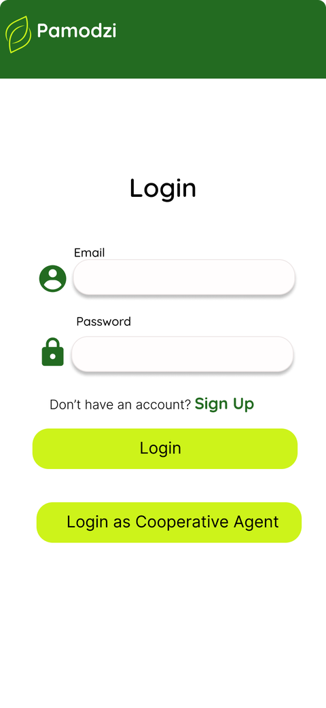
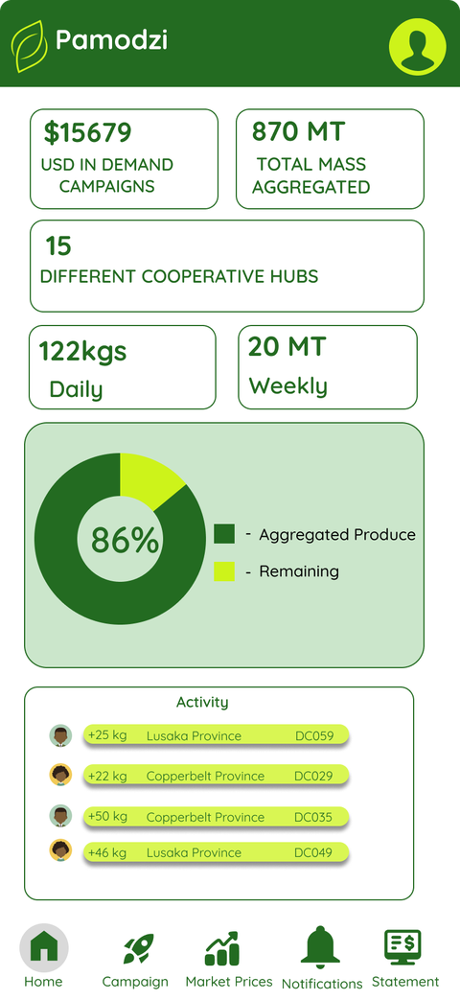
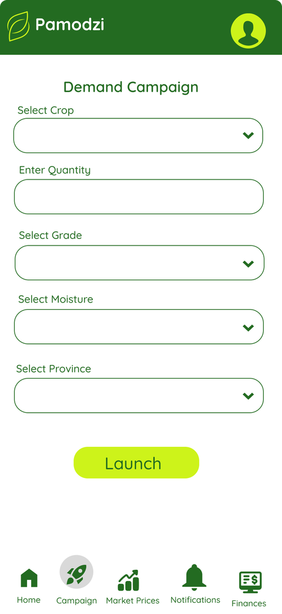
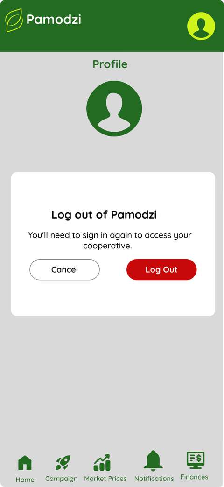

# Mobile App

The Pamodzi mobile application is a Flutter-based application that provides **role-specific functionality for Wholesale Buyers and Cooperative Agents**.

Current mobile functionality includes authentication, demand campaign management, campaign monitoring, farmer registration, produce verification, market-price information, profile functionality, notifications, and financial information.

The functionality available to a user depends on their assigned role and the navigation flow implemented in the application.

The mobile application communicates with the Pamodzi backend API to retrieve and submit application data.

```
The mobile application is currently under development and has not yet been deployed to production.

```

---

## Overview

### Purpose

The mobile application provides a mobile interface for the operational activities performed by Wholesale Buyers and Cooperative Agents within the Pamodzi platform.

The application provides different experiences based on the user's role.

### Supported Users

| User                  | Primary responsibilities                                                                                             |
| --------------------- | -------------------------------------------------------------------------------------------------------------------- |
| **Wholesale Buyer**   | Manage demand campaigns, monitor campaign activity, view market prices, and manage their account.                    |
| **Cooperative Agent** | Register farmers, verify produce and access relevant operational information. |

### Core Capabilities

The current mobile application includes the following major capabilities:

* User authentication
* Buyer registration and login
* Cooperative Agent authentication
* Dashboard and activity monitoring
* Demand campaign creation
* Campaign listing and monitoring
* Farmer registration
* Produce verification
* Market-price monitoring
* Profile management
* Theme switching
* Financial information
* Notifications

---

## High-Level Application Flow

The application follows a role-based flow.

```text
                         Pamodzi Mobile App
                                  |
                              Splash Screen
                                  |
                              Onboarding
                                  |
                              Authentication
                           /                  \
                          /                    \
                Wholesale Buyer        Cooperative Agent
                       |                       |
                  Buyer Home              Agent Home
                       |                       |
             ┌─────────┼─────────┐       ┌────┼──────────┐
             |         |         |       |    |          |
          Campaigns  Market    Profile  Farmer Produce  Other
                     Prices             Registration Verification
```

---

## Getting Started

### Prerequisites

Before working on the mobile application, ensure that the development environment has the required Flutter and Dart tooling installed.

The project is a Flutter application and can be developed using a supported IDE such as Android Studio or Visual Studio Code.

Recommended prerequisites:

* Flutter SDK
* Dart SDK
* Android Studio or Visual Studio Code
* Android SDK for Android development
* Git
* A connected Android device or emulator


### Clone the Repository

Clone the mobile application repository and navigate into the project directory.

```bash
git clone <mobile-repository-url>
cd pamodzi
```

### Install Dependencies

After opening the project, install the dependencies defined in `pubspec.yaml`.

```bash
flutter pub get
```

### Run the Application

Start an emulator or connect a physical device and run:

```bash
flutter run
```

### Verify the Development Environment

Use the following command to identify missing Flutter or Android development dependencies:

```bash
flutter doctor
```

Resolve any environment issues reported by `flutter doctor` before beginning development.

---

## Tech Stack

| Technology            | Purpose                                                                         |
| --------------------- | ------------------------------------------------------------------------------- |
| **Flutter**           | Framework used to build the mobile application.                                 |
| **Dart**              | Programming language used by the Flutter application.                           |
| **Pamodzi API**       | Backend API used by the mobile application for application data and operations. |
| **OpenAPI / Swagger** | Interactive reference for the backend API endpoints and schemas.                |
| **Git**               | Source-code version control.                                                    |
| **Figma**             | UI/UX design reference for the mobile application.                              |


### External References

**Pamodzi Backend API**

The interactive Swagger/OpenAPI documentation provides the available backend endpoints, request parameters, response schemas, and API operations used when integrating the mobile application with the backend.

→ [Open Pamodzi API Documentation](https://pamodzi-bbe9f0671866.herokuapp.com/docs)

**Phoenix Mobile UI**

The Figma file contains the mobile application's UI/UX designs and should be used as the visual reference when implementing or reviewing mobile screens.

→ [Open Phoenix Mobile UI in Figma](https://www.figma.com/design/mesXrW3dt9qWCyJqgbcakJ/Phoenix?node-id=706-2&t=fVk2cBM2jdGTpHzs-1)

---

## Project Structure

The Flutter application is organized into platform configuration, assets, application code, tests, and supporting project files.

```text
pamodzi/
├── .github/
├── android/
├── assets/
├── build/
├── fonts/
├── ios/
├── linux/
├── macos/
├── test/
├── web/
├── windows/
│
├── lib/
│   ├── models/
│   ├── screens/
│   ├── services/
│   ├── widgets/
│   └── main.dart
│
├── .gitignore
├── analysis_options.yaml
├── pubspec.yaml
├── pubspec.lock
└── README.md
```

### `lib/`

`lib/` contains the application's Dart source code. Most feature development should take place inside this directory.

### `lib/models/`

The `models` directory contains Dart models representing data used by the application.

Current models include:

```text
models/
├── campaign.dart
├── dashboard_model.dart
├── market_price_model.dart
├── notification_item.dart
└── profile_model.dart
```

These models provide structured representations of application data used by screens and services.

### `lib/screens/`

The `screens` directory contains the application's user-facing screens and feature-specific screen folders.

Current areas include:

```text
screens/
├── campaign_details/
├── campaign_list/
├── demand_campaign_form/
├── main/
├── notifications/
├── agent-login.dart
├── buyer-login.dart
├── buyer-signup.dart
├── homescreen.dart
├── market_price_screen.dart
├── profile_screen.dart
└── splash_screen.dart
```

### `lib/services/`

The `services` directory contains application services responsible for operations that are shared across screens.

The current project contains:

```text
services/
└── api_service.dart
```

`api_service.dart` is used for communication between the mobile application and backend services.

!!! note

```
The exact API methods and authentication handling to be documented here after the latest mobile code is merged and the service implementation is confirmed.
```

### `lib/widgets/`

The `widgets` directory contains reusable UI components used by multiple screens.

Current reusable components include:

```text
widgets/
├── bottom_nav.dart
├── pamodzi_header.dart
└── status_badge.dart
```

### `lib/main.dart`

`main.dart` is the application's entry point. It initializes and starts the Flutter application.

### Platform Directories

The platform-specific directories contain configuration required for running the Flutter application on different platforms:

* `android/` — Android application configuration
* `ios/` — iOS application configuration
* `web/` — Web configuration
* `windows/` — Windows configuration
* `macos/` — macOS configuration
* `linux/` — Linux configuration

The mobile deployment process primarily concerns the Android and iOS directories.

---

## Application Architecture

The current application is organized around screens, reusable widgets, models, and services.

A simplified data flow is:

```text
User Interaction
       |
       v
     Screen
       |
       v
    Service
       |
       v
   Pamodzi API
       |
       v
    Backend
       |
       v
   Application Data
       |
       v
     Model
       |
       v
     Screen
```

### Screen Layer

Screens are responsible for presenting information and receiving user interaction.

Examples include:

* Login
* Home Dashboard
* Demand Campaign
* Campaign List
* Market Price
* Profile
* Farmer Registration
* Produce Verification

### Service Layer

Services provide a separation between the UI and backend communication.

The API service is responsible for sending requests to the backend and returning the relevant data to the application.

### Model Layer

Models provide structured Dart representations of application data.

For example:

* Campaign data
* Dashboard information
* Market-price information
* Notifications
* Profile information

### Widget Layer

Reusable widgets provide shared UI components and help maintain consistent interfaces across screens.

---

## Authentication

The mobile application supports authentication for both supported user types.

### Wholesale Buyer

The current buyer flow includes:

```text
Buyer
  |
  v
Buyer Login
  |
  ├── Existing account → Login
  |
  └── New user → Buyer Signup
  |
  v
Buyer Application
```

The buyer login screen is implemented through:

```text
buyer-login.dart
```

Buyer registration is implemented through:

```text
buyer-signup.dart
```

### Cooperative Agent

Cooperative Agents follow a separate authentication path:

```text
Cooperative Agent
       |
       v
Agent Login
       |
       v
Agent Application
```

The current project contains:

```text
agent-login.dart
```

The existing documentation indicates that the Agent authentication flow uses a `staff_id`.

!!! note "Authentication implementation"

```
The exact token type, token storage mechanism, expiration handling, refresh behaviour, and logout implementation to be confirmed from the merged mobile authentication code.
```

---

## User Roles and Access

The application distinguishes between Wholesale Buyers and Cooperative Agents.

### Wholesale Buyer

The buyer experience currently includes:

* Authentication
* Home dashboard
* Demand campaigns
* Campaign list
* Market prices
* Profile
* Financial information

### Cooperative Agent

The Cooperative Agent experience currently includes:

* Agent authentication
* Farmer registration
* Produce verification
* Operational information
* Profile and other available application functionality

!!! note

```
Role-based route protection and the final list of screens available to each role to be updated after the latest mobile implementation is merged.
```

---

## Navigation

Navigation is currently centered around the application's main screen and bottom navigation components.

Relevant files include:

```text
screens/main/main_screen.dart
widgets/bottom_nav.dart
```

The navigation structure should provide users with access to the features available to their role.

### Role-Based Navigation

The intended high-level behaviour is:

```text
                         Authentication
                               |
                ┌──────────────┴──────────────┐
                |                             |
         Wholesale Buyer              Cooperative Agent
                |                             |
           Buyer Home                    Agent Home
                |                             |
        Buyer Features                Agent Features
```
```
The exact route names and route guards to be updated when the latest mobile code is merged.
```

---

## Screens and Features

### Login

{ width="220" }

The login screen provides authentication for application users.

Wholesale Buyers authenticate through the buyer login flow, while Cooperative Agents use their separate authentication path.

**Implementation references:**

```text
lib/screens/buyer-login.dart
lib/screens/agent-login.dart
```

**Related resources:**

* [Backend API Documentation](https://pamodzi-bbe9f0671866.herokuapp.com/docs)
* [Phoenix Mobile UI](https://www.figma.com/design/mesXrW3dt9qWCyJqgbcakJ/Phoenix?node-id=706-2&t=fVk2cBM2jdGTpHzs-1)

---

### Home Dashboard

{ width="220" }

The dashboard provides an overview of operational activity.

The current dashboard includes information such as:

* Demand campaign value
* Aggregated mass
* Cooperative hub count
* Daily volume
* Weekly volume
* Aggregation progress
* Recent activity
* Provincial activity information

**Implementation reference:**

```text
lib/screens/homescreen.dart
```

---

### Demand Campaign

{ width="220" }

The Demand Campaign screen allows a Wholesale Buyer to create a funded demand campaign.

The current form captures:

* Crop
* Quantity
* Grade
* Moisture
* Province

The campaign information corresponds to the backend demand-campaign functionality.

**Implementation reference:**

```text
lib/screens/demand_campaign_form/demand_campaign.dart
```

**Related documentation:**

* [Database Documentation](https://docs.google.com/document/d/1XQybjymnVYrOXz7y_ZkNjomQrStWmoba8YM4qL-QWY4/edit?usp=sharing)
* [Pamodzi API Documentation](https://pamodzi-bbe9f0671866.herokuapp.com/docs)
* [Phoenix Mobile UI](https://www.figma.com/design/mesXrW3dt9qWCyJqgbcakJ/Phoenix?node-id=706-2&t=fVk2cBM2jdGTpHzs-1)

---

### Campaign List

The Campaign List provides an overview of campaigns and their current states.

The current documentation identifies campaign states including:

* Active
* Aggregating
* Fulfilled

**Implementation reference:**

```text
lib/screens/campaign_list/campaign_list.dart
```

---

### Campaign Details

The Campaign Details feature provides information about an individual campaign.

**Implementation reference:**

```text
lib/screens/campaign_details/campaign_details.dart
```

---

### Produce Verification

Produce Verification supports the Cooperative Agent workflow for reviewing and approving or rejecting a farmer's produce listing.

**Implementation reference:**

```text
ProduceVerificationBody
```

```
The final API interaction and verification states to be documented after the latest mobile implementation is merged.

```
---

### Farmer Registration

Farmer Registration allows a Cooperative Agent to register a farmer on the farmer's behalf.

**Implementation reference:**

```text
FarmerRegistrationBody
```

```
The final form fields, validation rules, API endpoint, and success/error behaviour to be updated after the latest implementation is merged.

```

---

### Market Price


The Market Price screen displays crop-based market price information and price trends.

**Implementation reference:**

```text
lib/screens/market_price_screen.dart
```

---

### Profile

{ width="220" }

The Profile screen provides account-related functionality and application settings.

The current implementation includes:

* Profile information
* Theme switching
* Logout
* Logout confirmation

**Implementation reference:**

```text
lib/screens/profile_screen.dart
```

```
The final authentication/session behaviour to be updated when the merged implementation is available.

```

---

### Notifications

The application includes a notifications area for displaying relevant user notifications.

**Current project location:**

```text
lib/screens/notifications/
```

The notification data model is:

```text
lib/models/notification_item.dart
```

---

### Financial Information

Financial information is part of the current mobile application feature set.

The current architecture documentation references:

```text
FinancialDetailsScreen
```

```
The final screen location and API integration to be verified against the merged mobile implementation.

```

---

## UI and Design Reference

The Figma design is the primary visual reference for the mobile interface.

Developers should use the Figma file when:

* Implementing new screens
* Matching spacing and component layouts
* Checking typography
* Checking component states
* Verifying navigation flows
* Comparing implemented screens with approved designs

**Design reference:**

→ [Open Phoenix Mobile UI in Figma](https://www.figma.com/design/mesXrW3dt9qWCyJqgbcakJ/Phoenix?node-id=706-2&t=fVk2cBM2jdGTpHzs-1)

---

## API Integration

The mobile application communicates with the Pamodzi backend API.

### API Reference

The authoritative interactive API reference is the Pamodzi Swagger/OpenAPI documentation:

→ [Open Pamodzi API Documentation](https://pamodzi-bbe9f0671866.herokuapp.com/docs)

Use the API documentation to verify:

* Available endpoints
* HTTP methods
* Request parameters
* Request bodies
* Authentication requirements
* Response structures
* Error responses
* Available backend resources

### Mobile-to-Backend Flow

```text
Flutter Screen
      |
      v
API Service
      |
      v
HTTP Request
      |
      v
Pamodzi Backend API
      |
      v
Backend Processing
      |
      v
API Response
      |
      v
Dart Model
      |
      v
Flutter UI
```

### API Service

The current project contains:

```text
lib/services/api_service.dart
```

This service is the main location identified for backend API communication.


```
Individual endpoint mappings to be added once the latest mobile implementation is merged.
```

---

## Loading, Empty and Error States

Every API-driven feature should account for the following states:

### Loading

The application should provide appropriate feedback while data is being retrieved or submitted.

### Success

After a successful API operation, the application should update the relevant UI and provide the appropriate navigation or confirmation.

### Empty

When an API returns no applicable data, the screen should provide a meaningful empty state rather than appearing broken or blank.

### Error

When an API request fails, the application should provide an understandable error message and, where appropriate, allow the user to retry.

!!! note

```
The exact error-handling implementation to be documented after the latest mobile code is merged.
```

---

## Offline and Connectivity Behaviour

The current project documentation identifies low-connectivity rural environments as an important consideration.

The intended application behaviour includes local persistence and delayed synchronization.


```
The exact local-storage technology, synchronization mechanism, conflict handling, and offline-supported features to be confirmed against the latest mobile implementation.
```

---

## Testing

The Flutter project contains a test directory:

```text
test/
```

Mobile changes should be tested before being merged.

Testing should cover, where applicable:

* Authentication
* Navigation
* Form validation
* API interactions
* Model parsing
* User-role behaviour
* Loading states
* Empty states
* Error states
* Critical user flows

### Running Tests

Run the Flutter test suite with:

```bash
flutter test
```

For changes affecting a specific feature, developers should also perform manual testing on an emulator or physical device.

---

## Deployment

```
The mobile application is currently under development and has **not yet been deployed to production**.

```

The final deployment process will be documented once the team's deployment target and release process are confirmed.

### Current Status

| Area                           | Status           |
| ------------------------------ | ---------------- |
| Mobile application development | In progress      |
| Backend API                    | Available        |
| Figma UI                       | Available        |
| Production mobile deployment   | Not yet deployed |
| Appetize deployment            | To be confirmed  |
| Final release process          | To be documented |

### Future Deployment Flow

The expected deployment process will follow a flow similar to:

```text
Development
     |
     v
Feature Testing
     |
     v
Integration Testing
     |
     v
Release Build
     |
     v
Deployment Platform
     |
     v
Release / Distribution
```

---

## Troubleshooting

### Flutter dependencies are missing

Run:

```bash
flutter pub get
```

### Flutter environment problems

Run:

```bash
flutter doctor
```

Review the reported issues and resolve the missing Android SDK, emulator, or Flutter configuration requirements.

### API requests fail

Check:

1. The backend API is available.
2. The application is using the correct backend environment.
3. The request matches the API documentation.
4. Authentication credentials/token requirements are satisfied.
5. The request payload matches the backend schema.

Use the [Pamodzi API Documentation](https://pamodzi-bbe9f0671866.herokuapp.com/docs) to verify endpoint requirements.

---

### Developer Resources

**Pamodzi API Documentation**

Interactive Swagger/OpenAPI documentation for the Pamodzi backend. Use this reference when implementing or troubleshooting mobile-to-backend API integrations, checking available endpoints, request parameters, response schemas, and API operations.

→ [Open Pamodzi API Documentation](https://pamodzi-bbe9f0671866.herokuapp.com/docs)

**Phoenix Mobile UI**

The Figma design file containing the mobile application's UI designs and user flows. Use this as the visual reference when implementing or reviewing mobile screens.

→ [Open Phoenix Mobile UI in Figma](https://www.figma.com/design/mesXrW3dt9qWCyJqgbcakJ/Phoenix?node-id=706-2&t=fVk2cBM2jdGTpHzs-1)

**Security Documentation**

Documentation covering the security mechanisms and authentication-related behaviour of the Pamodzi platform. Use this reference when working on authentication, authorization, sessions, and other security-related functionality.

→ [Open Security Documentation](https://docs.google.com/document/d/1M1G0d1_iJ-TlkoZ_JsAh7D9aeC_B8WKWebvilvGIwz0/edit?usp=sharing)

**Database Documentation**

Reference documentation for the Pamodzi database, including the application's data entities and their relationships. Use this when you need to understand how mobile application data relates to the backend data model.

→ [Open Database Documentation](https://docs.google.com/document/d/1XQybjymnVYrOXz7y_ZkNjomQrStWmoba8YM4qL-QWY4/edit?usp=sharing)
---

## Documentation Maintenance

This document should be updated whenever a significant mobile application change is introduced.

Update the relevant section when:

* A new screen is added
* A screen is removed
* A user role changes
* Navigation changes
* An API endpoint changes
* A new API integration is introduced
* A new dependency is added
* Authentication behaviour changes
* Offline behaviour changes
* Deployment procedures change
* The Figma design changes


# Mobile App

The mobile app (Flutter) is used by Cooperative Agents and Wholesale Buyers for field operations, campaign management, and finance tracking.


## Screens

<div class="grid cards" markdown>

-   :material-login:{ .lg .middle } **Login**

    ---

    Buyer login/signup plus a separate agent login path (`agent-login.dart`, `buyer-login.dart`, `buyer-signup.dart`).

-   :material-view-dashboard:{ .lg .middle } **Home Dashboard**

    ---

    Campaign KPIs, aggregation progress, activity feed (`homescreen.dart`).

-   :material-rocket-launch:{ .lg .middle } **Demand Campaign**

    ---

    Buyer launches a funded campaign — crop, quantity, grade, moisture, province (`demand_campaign_form/demand_campaign.dart`).

-   :material-account-circle:{ .lg .middle } **Profile**

    ---

    Account settings, theme switching (`profile_screen.dart`).

-   :material-clipboard-list:{ .lg .middle } **Campaign List**

    ---

    Active/aggregating/fulfilled campaigns at a glance (`campaign_list/campaign_list.dart`).

-   :material-check-decagram:{ .lg .middle } **Produce Verification**

    ---

    Agent flow for approving/rejecting a farmer's listing (`ProduceVerificationBody`).

-   :material-account-plus:{ .lg .middle } **Farmer Registration**

    ---

    Agent onboards a farmer on their behalf (`FarmerRegistrationBody`).

-   :material-chart-line:{ .lg .middle } **Market Price**

    ---

    Price trend charts by crop (`MarketPriceScreen`).

</div>

## Screens in Detail

=== "Login"

    

    Buyer login with email/password. A separate "Login as Cooperative Agent" button routes to `staff_id`-based auth instead.

=== "Home Dashboard"

    

    Demand campaign value, mass aggregated, cooperative hub count, daily/weekly volume, aggregation-progress ring, and a recent-activity feed by province.

=== "Demand Campaign"

    

    Crop, quantity, grade, moisture, and province — maps directly to the `demandcampaign` table in [Database](database.md).

=== "Profile"

    

    Confirm-before-logout modal, consistent with the token-blacklist logout flow in Security.

!!! info "Remaining screens"
    Campaign List, Produce Verification, Farmer Registration, and Market Price don't have exports yet — add them here the same way once available.

## Architecture Pattern

Navigation routing, screen state lifecycle, and view component structure are centered on `MainScreen` and `PamodziBottomNav`.

<div class="grid cards" markdown>

-   :material-account-arrow-right:{ .lg .middle } **Onboarding & Authentication**

    ---

    Onboarding carousel (`PamodziOnboardingFlow`), agent login (`AgentLoginScreen`), buyer login/signup (`buyer-login.dart`, `buyer-signup.dart`).

-   :material-tractor:{ .lg .middle } **Operations**

    ---

    Farmer registration (`FarmerRegistrationBody`), produce quality verification (`ProduceVerificationBody`).

-   :material-storefront:{ .lg .middle } **Marketplace & Finance**

    ---

    Active demand campaigns (`CampaignListBody`), market price charts (`MarketPriceScreen`), financial statements (`FinancialDetailsScreen`).

-   :material-cog:{ .lg .middle } **Settings**

    ---

    Dynamic light/dark theme switching, user profile management (`ProfileScreen`).

</div>

!!! tip "Offline Behavior"
    Local data persistence with delayed synchronization, built for low-connectivity rural regions.

## Project Structure

??? note "pamodzi/ — full Flutter project tree"

```text
    pamodzi/
    ├── .github/
    ├── android/
    ├── assets/
    ├── build/
    ├── fonts/
    ├── ios/
    ├── linux/
    ├── macos/
    ├── test/
    ├── web/
    ├── windows/
    ├── lib/
    │   ├── models/
    │   │   ├── campaign.dart
    │   │   ├── dashboard_model.dart
    │   │   ├── market_price_model.dart
    │   │   ├── notification_item.dart
    │   │   └── profile_model.dart
    │   ├── screens/
    │   │   ├── campaign_details/
    │   │   │   └── campaign_details.dart
    │   │   ├── campaign_list/
    │   │   │   └── campaign_list.dart
    │   │   ├── demand_campaign_form/
    │   │   │   └── demand_campaign.dart
    │   │   ├── main/
    │   │   │   └── main_screen.dart
    │   │   ├── notifications/
    │   │   ├── agent-login.dart
    │   │   ├── buyer-login.dart
    │   │   ├── buyer-signup.dart
    │   │   ├── homescreen.dart
    │   │   ├── market_price_screen.dart
    │   │   ├── profile_screen.dart
    │   │   └── splash_screen.dart
    │   ├── services/
    │   │   └── api_service.dart
    │   ├── widgets/
    │   │   ├── bottom_nav.dart
    │   │   ├── pamodzi_header.dart
    │   │   └── status_badge.dart
    │   └── main.dart
    ├── .gitignore
    ├── analysis_options.yaml
    ├── pubspec.yaml
    ├── pubspec.lock
    └── README.md
```
