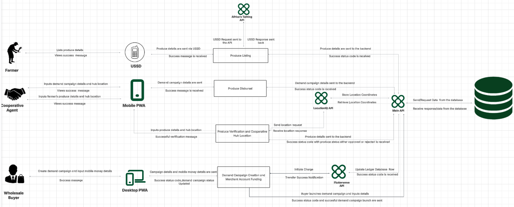

# Pamodzi System Documentation

## 1. System Overview

Pamodzi is an aggregator platform designed to streamline the smallholder agricultural supply chain in Zambia. The system connects commercial wholesale buyers with smallholder farmers who are organized through agricultural cooperatives.

The platform provides a structured way to capture farmer and cooperative information, record available produce, receive wholesale demand, aggregate produce against demand campaigns, and record payment activity.

The Pamodzi data model is based on a relational database structure. Entities are represented as tables and are connected through primary and foreign keys to maintain relationships and data integrity.

The system is designed around the different ways its users interact with the platform:

- **Farmers** interact through **USSD**.
- **Cooperative Agents** interact through the **Mobile App**.
- **Wholesale Buyers** interact through the **Mobile App**.
- **System Admin** interact through the **Dashboard**.

The applications communicate with the **Pamodzi API**, which communicates with the database and the required external services.

---

## 2. System Architecture

The Pamodzi architecture consists of user-facing applications, the Pamodzi API, external APIs, and the database.




The following resources provide the supporting system architecture and ERD project information.

🔗 [System Architecture Diagram](https://lucid.app/lucidchart/c05218bb-cec1-4702-8aca-515a6a8bdfc1/edit?viewport_loc=-9273%2C-11611%2C9514%2C6279%2C0_0&invitationId=inv_4e2e83fd-4706-4d12-97f5-ba1d561a441a)

🔗 [ERD Document](https://docs.google.com/document/d/17-KdHhf3edFc5MXNn2SJIU5dFrdC0z8ew3zJSTRr51g/edit?usp=sharing)


### 2.1 User-Facing Applications

The system provides different interfaces depending on the user interacting with the platform.

### USSD and SMS Notification

The USSD interface is used by **Farmers** to interact with the system.

Through USSD, farmers can:

- list available produce;
- Update their listings; 
- Update their pin number;
- receive success messages and responses.

The architecture shows produce details being sent through the USSD flow and a response being returned to the farmer.

#### Mobile App

### Mobile App Agent Interface

The Mobile App is used by **Cooperative Agents**.

Through the Mobile App, Cooperative Agents can:

- input demand campaign details and hub location;
- input farmer produce details and hub location;
- view success messages; and
- receive produce verification results.

### Mobile App Buyers Interface

The Mobile App is used by **Wholesale Buyers**.

Through the Mobile App, Wholesale Buyers can:

- create demand campaigns;
- receive campaign and payment status information;
- recieve messages to extend demand campaign timeline;
- view market prices for the different crops the platform deals with.

---

## 3. Pamodzi APi

**Pamodzi API** acts as the central communication point between the user-facing applications, database, and external services.

It handles communication involving:

- produce information;
- demand campaign information;
- cooperative information;
- cooperative hub location information;
- database requests and responses;
- payment-related information; 
- merchant account information;
- produce pool information;
- user details;
- status responses.

The architecture shows Pamodzi API sending requests to and receiving responses from the database.

Pamodzi API also connects the platform with the external **LocationIQ API** and **Flutterwave API**, while the USSD flow uses the **Africa's Talking API**.

---

## 4. External APIs

The system architecture identifies three external APIs.

### 4.1 Africa's Talking API

Africa's Talking API is used in the USSD flow.

The interaction follows this process:

1. The farmer interacts with USSD.
2. The farmer provides produce details.
3. A USSD request is sent through the Africa's Talking API.
4. A USSD response is returned.
5. The farmer receives the relevant response or success message.

The USSD flow provides farmers with a way to interact with the system through their feature phones.

---

### 4.2 LocationIQ API

LocationIQ provides location information for cooperative hubs.

The location flow is:

1. Cooperative hub location information is entered through the Mobile App.
2. A location request is sent.
3. The LocationIQ API returns a location response.
4. The location information is handled through the Pamodzi API.
5. The location information is stored in the database.

The data model represents cooperative hub location information through the `cooperative` entity.

---

### 4.3 Flutterwave API

Flutterwave is used in the platform's payment flow.

The architecture shows the following process:

1. A Wholesale Buyer creates a demand campaign.
2. Mobile money details are provided.
3. Campaign and mobile money details are sent to the demand campaign creation and merchant account funding process.
4. A charge is initiated.
5. A transfer success notification is received.
6. The ledger/database is updated.
7. A success status is returned.

The data model includes the **Merchant Account** and **Payment Transaction** entities for recording financial information associated with this flow.

---

## 5. System Components

| Component | Responsibility |
|---|---|
| **USSD** | Provides the Farmer interaction channel for listing produce and receiving responses. |
| **Dashboard** | Provides the Admin interaction channel to view all the demand campaigns launched, produce listed, financial transactions and produce aggregated and the market price for the 4 crops dealt with. |
| **Mobile APP Agent Interface** | Provides the Cooperative Agent interaction channel for produce, demand campaign, hub location, and verification activities. |
| **Mobile APP Buyers Interface** | Provides the Wholesale Buyer interaction channel for demand campaign creation and financial transaction and demand campaign information. |
| **Pamodzi API** | Connects applications with the database and external APIs. |
| **Africa's Talking API** | Supports the USSD request and response flow. |
| **LocationIQ API** | Provides cooperative hub location information. |
| **Flutterwave API** | Supports the payment and merchant account funding flow. |
| **Database** | Stores structured platform information including users, cooperatives, produce, demand campaigns, accounts, and payments. |

---

## 6. User Roles

Pamodzi identifies different users who interact with the platform through different channels.

### 6.1 Farmer

Farmers are smallholder agricultural producers associated with cooperatives.

Farmer information is obtained from the cooperative when the farmer is onboarded.

The Farmer entity contains:

- `farmer_id`
- `user_id`
- `cooperative_id`
- `is_verified`

Farmers' produce is recorded through the **Produce Listing** entity.

Farmers interact with the system through **USSD**.

---

### 6.2 Cooperative Agent

Cooperative Agents are platform operators associated with cooperatives. They manage intake and quality verification workflows in the field.

The Cooperative Agent entity contains:

- `agent_id`
- `user_id`
- `cooperative_id`
- `staff_id`
- `registered_at`
- `agent_status`

Cooperative Agents use the **Mobile App Agent Interface** to provide produce information, hub location information, demand campaign information, and receive verification results.

---

### 6.3 Wholesale Buyer

Wholesale Buyers access the platform for large-scale agricultural purchasing.

The Wholesale Buyer entity contains:

- `buyer_id`
- `user_id`
- `password_hash`
- `email`
- `company_name`
- `created_at`
- `pacra_number`
- `tax_clearance_number`

Wholesale Buyers use the **Mobile App** to create demand campaigns and provide mobile money information.

---

### 6.4 Admin

Admin access the platform for the whole overview.

The Admin entity contains:

- `user_id`
- `password_hash`
- `email`
- `created_at`

Admin use the **Dashboard** to oversee all the operations that are happening in the platform .

---


## 7. Core System Flow

The main purpose of the system is to connect wholesale demand with farmer supply through cooperatives.

The high-level flow is:

```text
Wholesale Buyer
   |
   | Mobile App
   v
Launch Demand Campaign
   |
   v
Pamodzi API
   |
   v
Database
   |
   v
Produce listing
   |
   v
Produce Pool
   |
   v
Produce Aggregation
   |
   v
Wholesale Buyer