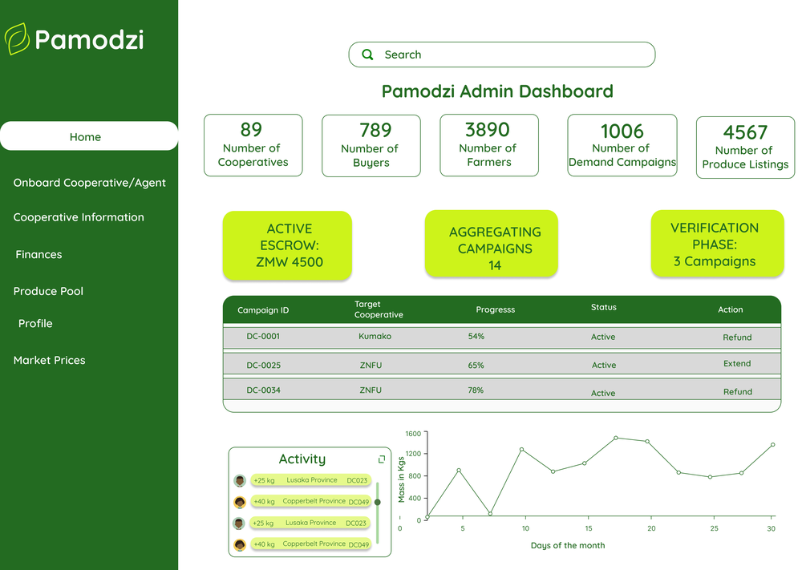
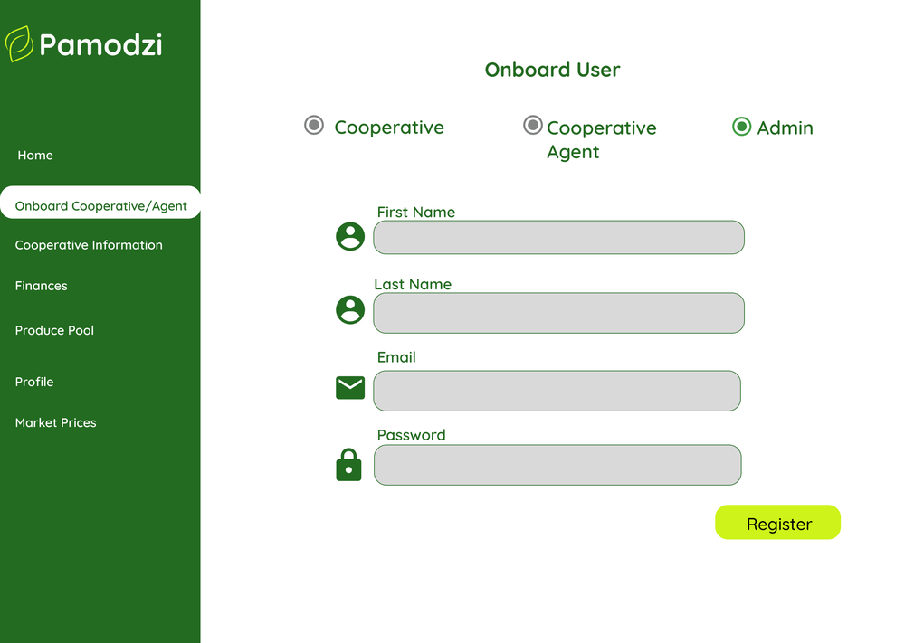
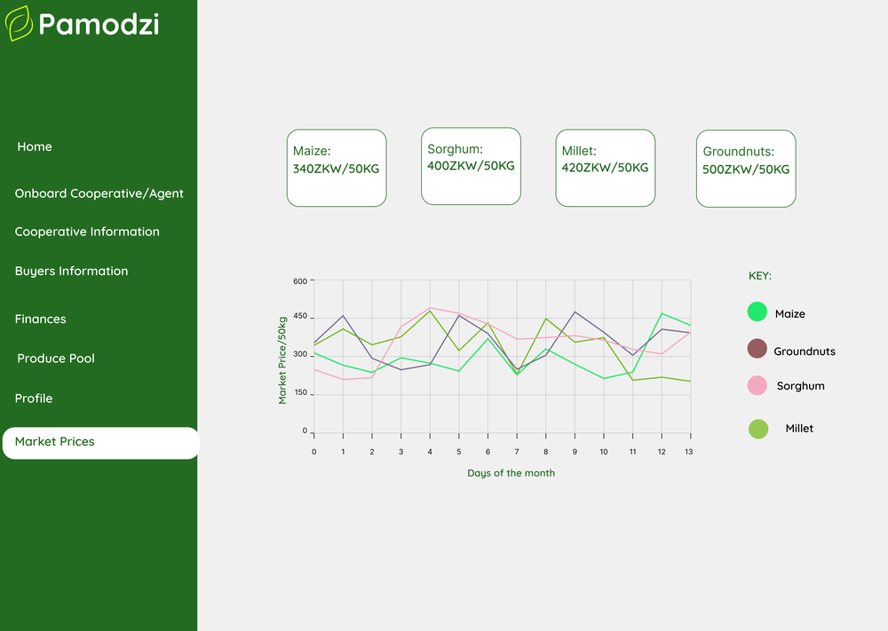

# Web Dashboard

The Desktop PWA is where **Administrators** manage every ongoing process on the platform — cooperatives, market prices, finance, and user onboarding.

## Screens

-   :material-view-dashboard:{ .lg .middle } **Home**

    ---

    Landing overview after login (`app/Home`).

-   :material-account-multiple-plus:{ .lg .middle } **Onboard User**

    ---

    Admin flow for onboarding new users (`app/dashboard/onboard-user`).

-   :material-domain:{ .lg .middle } **Cooperative Info**

    ---

    Cooperative hub details and location data (`CooperativeInformationDashboard.jsx`).

-   :material-chart-bell-curve:{ .lg .middle } **Market Price**

    ---

    Historical/current commodity price charts, built with `recharts` (`MarketPricesDashboard.jsx`).

-   :material-tray-full:{ .lg .middle } **Produce Pool**

    ---

    Aggregated produce views per campaign (`app/components/produce_pool`).

-   :material-cash:{ .lg .middle } **Finance**

    ---

    Finance cards and per-transaction detail views (`app/Finance`, `app/FinanceCards/[id]`).

-   :material-account-circle:{ .lg .middle } **Profile**

    ---

    User profile management, currently implemented with plain `useState` rather than `react-hook-form`.

## Some Screens in Detail

=== "Home"

    

    Live counts (cooperatives, buyers, farmers, campaigns, listings), escrow/phase status chips, an active-campaigns table with per-row refund/extend actions, an activity feed, and a 30-day aggregation trend chart.

=== "Onboard User"

    

    Single form, three roles via radio select — Cooperative, Cooperative Agent, Admin — routing to `POST /cooperatives/`, `POST /cooperative-agents/onboard`, or `POST /auth/admin/onboard` depending on which is picked.

=== "Market Price"

    

    Per-crop price cards (ZMW/50kg) above a multi-line trend chart with a color-coded legend — sourced from `GET /market-prices/current` and `/market-prices/history`.

## Brand guidelines

| Token | Value | Usage |
|---|---|---|
| Primary — Dark Green | `#236b21` | Headers, buttons, sidebar, borders across the dashboard |
| Accent — Lime | `#cdf31a` | Primary action buttons |
| Font | Quicksand | All dashboard typography |

### Crop accent colors

-   Maize

    `#3DDC5A`

-   Groundnuts

    `#7A5C4E`

-   Sorghum

    `#F6A6C1`

-   Millet

    `#9ACD32`

Assets: `logo.png` / `Pamodzi-logo.png` (in the Phoenix_Dashboard repo's `public/` — see the docs site's own logo in `docs/assets/images/`).